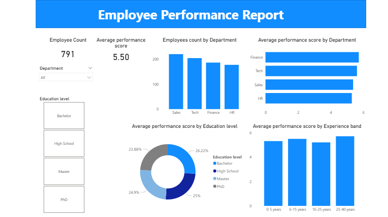
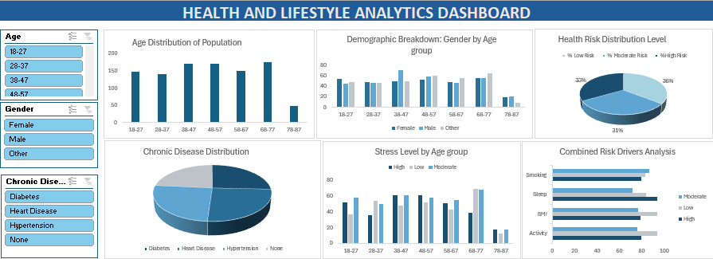

# DATA ANALYTICS PORTFOLIO
## Project 1

**Title:** [Employee Performance Report](https://github.com/OmotolaOlufemi/OmotolaOlufemi.github.io/blob/main/employee-performance.png)

**Tools Used:** Power BI()

**Project Description:**

**Key findings:**

**Dashboard Overview:**

## Project 2
**Title:** Employee analytics

**SQL Code:** [Employee analytics DDL and DML](https://github.com/OmotolaOlufemi/OmotolaOlufemi.github.io/blob/main/employeeanalytics.sql)

**SQL Skills Used:** 

Data Retrieval (SELECT): Queried and extracted specific information from the database.

Data Aggregation (SUM, COUNT): Calculated totals, such as sales and quantities, and counted records to analyze data trends.

Data Filtering (WHERE, BETWEEN, IN, AND): Applied filters to select relevant data, including filtering by ranges and lists.

Data Source Specification (FROM): Specified the tables used as data sources for retrieval

**Project Description:**

**Technology used:** SQL server

# DATA ANALYTICS PORTFOLIO
## Project 3

**Title:** [Health and Lifestyle Analytics Dashboard](https://github.com/OmotolaOlufemi/OmotolaOlufemi.github.io/blob/main/health-and-lifestyle.png)

**Tools Used:** Microsoft Excel()

**Project Description:**

**Key findings:**

**Dashboard Overview:**

# DATA ANALYTICS PORTFOLIO
## Project 4

**Title:** [Retail and Warehouse Sales Performance Dashboard](https://github.com/OmotolaOlufemi/OmotolaOlufemi.github.io/blob/main/sales.png)

**Tools Used:** Microsoft Excel()

**Project Description:**

**Key findings:**

**Dashboard Overview:**

[sales](sales.png)
