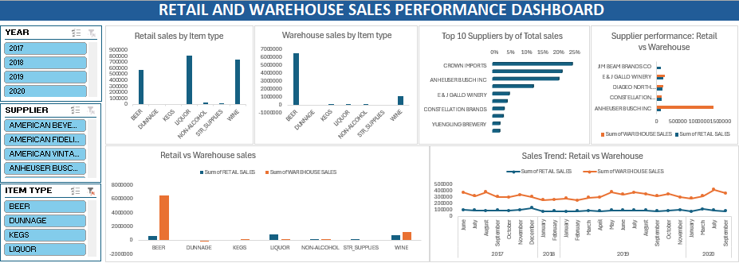

# DATA ANALYTICS PORTFOLIO
## Project 1

**Title:** [Employee Performance Report](https://github.com/OmotolaOlufemi/OmotolaOlufemi.github.io/blob/main/employee-performance.png)

**Tools Used:** Power BI()

**Project Description:** This project analyses employee performance data to provide a clear overview of productivity across the organisation. The dashboard helps HR and leadership monitor key performance metrics and compare results across departments, education levels and experience levels. It includes:

*Employee count and Average Performance Score:* A quick organisation snapshot.

*Performance by Department:* To highlight high and low performing areas.

*Performnace by Education Level:* To understand how qualifications relate to performance.

*Performance by Experience Level:* To show how tenure influences productivity.

*Employee Distribution:* To visualise workforce spread across departments.

**Key findings:**
*Department Performance:* Identified departments with strong and weak performnace levels.

*Education Insights:* Showed how different education levels correlate with performance outcomes.

*Experience Trends:* Revealed how years of experience impact performance scores.

*Wokforce Distribution:* Highlighted staffing patttern across departments.

*Performance Variability:* Exposed gaps that can guide training, development and HR planning.

**Dashboard Overview:**

# DATA ANALYTICS PORTFOLIO
## Project 2
**Title:** Employee analytics

**SQL Code:** [Employee analytics DDL and DML](https://github.com/OmotolaOlufemi/OmotolaOlufemi.github.io/blob/main/employeeanalytics.sql)

**SQL Skills Used:** 

Data Retrieval (SELECT): Queried and extracted specific information from the database.

Data Aggregation (SUM, COUNT): Calculated totals, such as sales and quantities, and counted records to analyze data trends.

Data Filtering (WHERE, BETWEEN, IN, AND): Applied filters to select relevant data, including filtering by ranges and lists.

Data Source Specification (FROM): Specified the tables used as data sources for retrieval

**Project Description:** This project involved analysing employee data using SQL to identify key workforce patterns trends. It provides a clear overview of essential HR metrics by querying and Aggregating data directly from the database. The project includes the following components:

*Data Retrieval (SELECT):* Extracted employee details such as department, salary and performance.

*Data Filtering (WHERE, BETWEEN, IN):* Focused on specific employee groups based on set conditions.

*Data Aggregation (SUM, COUNT, AVG):* Calculated totals and averages to reveal trends.

*Table Joins (FROM, JOIN):* Combined multiple tables for a complete view of employee information.

*Sorting and Grouping (ORDER BY, GROUP BY):* Organised results to highlight patterns across departments and roles.

**Technology used:** SQL server

# DATA ANALYTICS PORTFOLIO
## Project 3

**Title:** [Health and Lifestyle Analytics Dashboard](https://github.com/OmotolaOlufemi/OmotolaOlufemi.github.io/blob/main/health-and-lifestyle.png)

**Tools Used:** Microsoft Excel()

**Project Description:** This project involved analysing health and lifestyle data to identify key patterns affecting wellbeing across different age groups. It is designed to provide a clear overview of major health indicators. This dashboard allows stakeholders to easily monitoor trends in chronic diseases, stress levels and overall health risks. The dashboard includes the following features:

*Age Distribution:* Shows how individuals are spread across age groups.

*Chronic Disease Distribution:* Highlights the prevalence of chronic conditions within the population.

*Stress Levels by Age:* Displays how stress varies across different age categories.

*Health Risk Distribution:* Provides an overview of low, medium and high-risk individuals.

**Key findings:** 
*Age Patterns:* Identified which age groups have the highest representation and how they relate to health outcomes.

*Chronic Disease Insights:* Revealed the most common chronic conditions and their impact on overall health.

*Stress Trends:* Showed clear differences in stress levels across age groups.

*Health Risk Breakdown:* Highlighted the proportion of individuals in low, medium and high-risk categories.

*Wellbeing Variability:* Exposed patterns that can guide targeted health interventions and lifestyle support.

**Dashboard Overview:**

# DATA ANALYTICS PORTFOLIO
## Project 4

**Title:** [Retail and Warehouse Sales Performance Dashboard](https://github.com/OmotolaOlufemi/OmotolaOlufemi.github.io/blob/main/sales.png)

**Tools Used:** Microsoft Excel()

**Project Description:** This project involved analysing retail and warehouse sales data to compare performance across both channels. It is designed to provide a clear overview of key sales metrics. This dashboard allows stakeholders to easily monitor revenue, units sold and monthly performance trends for each channel. The dashboard includes the following features:

*Total Sales by Channel:* Shows overall sales performance for retail and warehouse operations.

*Monthly Sales Trend:* Displays month by month sales to highlight seasonal patterns and flunctuations.

*Units Sold by Channel:* Compares product movement across retail and warehouse outlets.

*Revenue Breakdown:* Shows how much revenue each channel contributes to overall business performance.

**Key findings:**
*Channel Comparison:* Identified which channel (retail or warehouse) generated higher sales and revenue.

*Seasonal Trends:* Revealed monthly sales patterns that help guide inventory and staffing decisions.

*Sales Variability:* Showed flunctuations in sales volume and revenue, supporting more accurate forecasting.

*Operational Insights:* Provided clarity on how each channel contributes to overall business growth.

**Dashboard Overview:**

